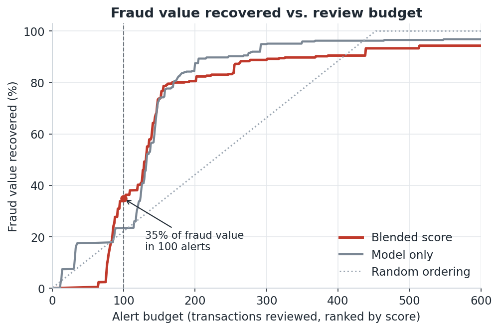
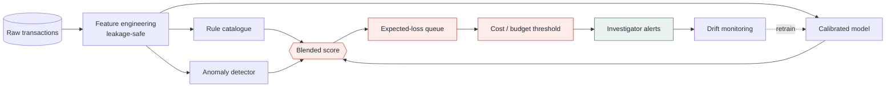
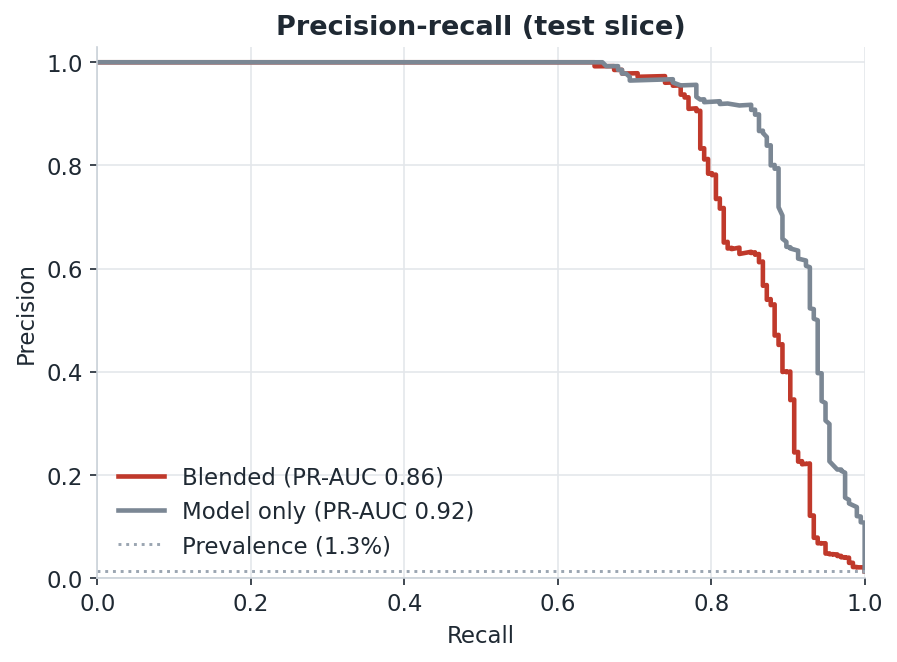
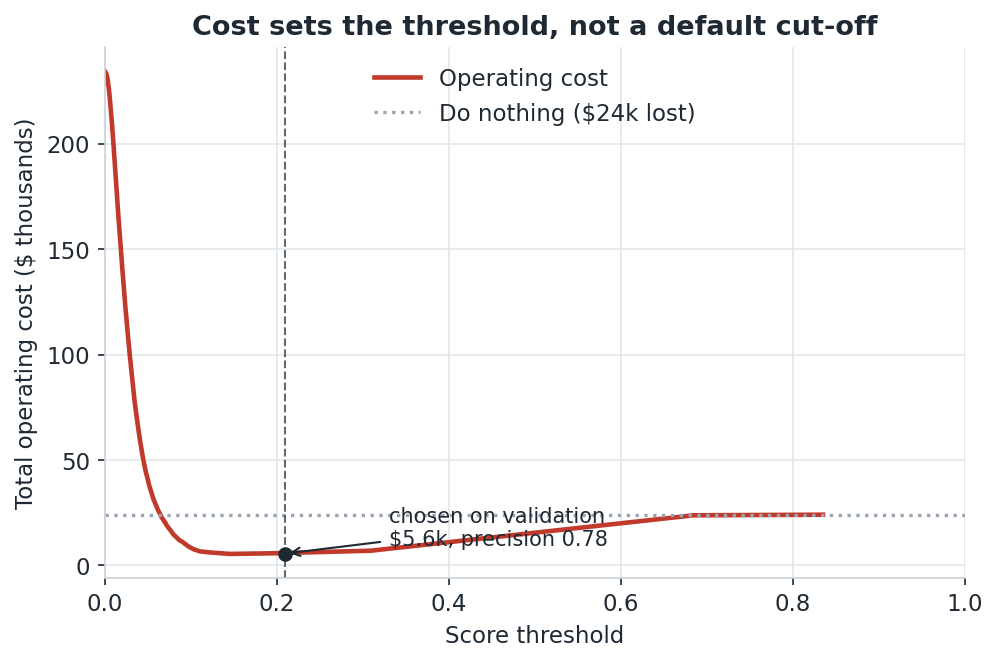
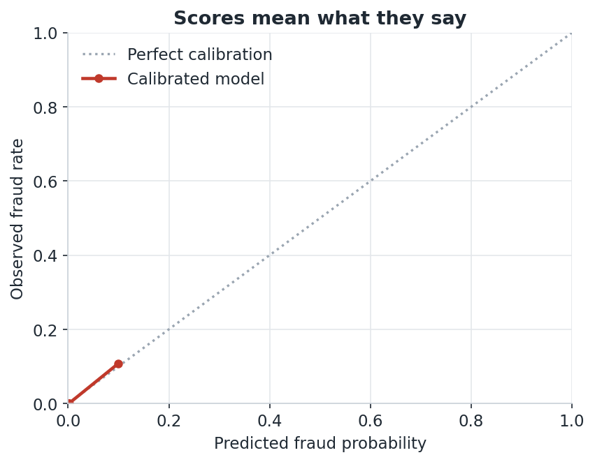
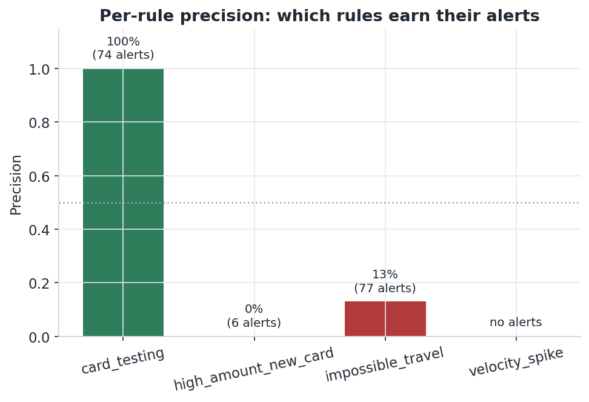
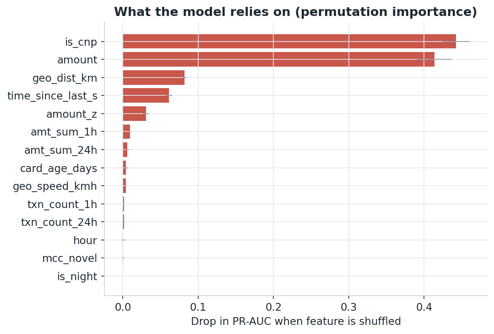
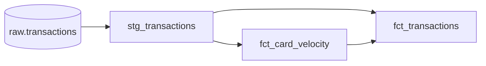
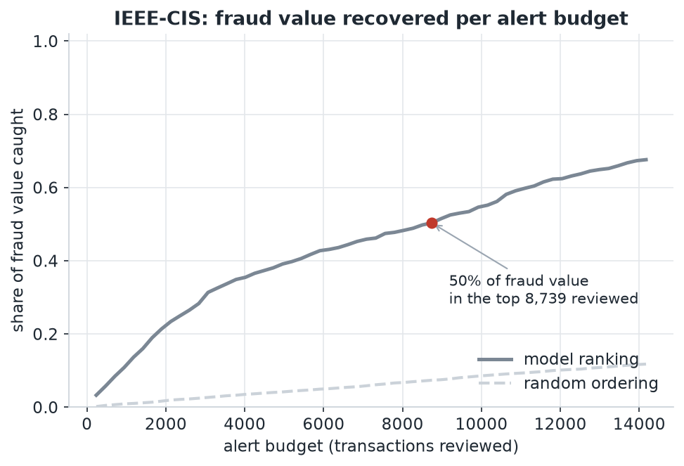

# Transaction Fraud Scoring and Alert Prioritisation

[](https://github.com/gbadedata/transaction-fraud-scoring/actions/workflows/ci.yml)
[](https://www.python.org/)
[](https://github.com/astral-sh/ruff)
[](LICENSE)

A transaction fraud scoring pipeline built around the constraint that defines real fraud operations: an investigation team can only review a fixed number of alerts per day. The goal is to prevent the most fraud value within that budget, keep false declines low, and detect drift before precision degrades. This is a runnable reference implementation with tests, a warehouse layer, and a triage dashboard, not a single notebook.

<p align="center">
  
</p>

This is the chart the whole project is built to move. Ranking transactions by expected loss, a queue of 100 alerts recovers about a third of all fraud value, and the blend of model, rules, and anomaly signals is chosen precisely to push this curve up. Random ordering barely leaves the floor. Everything else in the repository exists to make this line as high as it can go for a given budget.

## Architecture



Three signals feed one score. A supervised model gives calibrated probabilities, a transparent rule catalogue gives auditable tripwires, and an unsupervised detector catches novelty the other two miss. The queue is ordered by expected loss (probability multiplied by amount), the threshold is set from cost rather than a default cut-off, and drift on features and scores feeds back into retraining.

## Quickstart

```bash
make setup     # pip install -e ".[dev]"
make test      # 22 tests
make demo      # full pipeline on synthetic data, no downloads
make figures   # regenerate every chart in this README
```

The repository ships a data generator that produces realistic transactions with embedded fraud typologies (card testing, stolen-card bust-out, account-takeover spend) and legitimate confounders (big-ticket purchases, travellers), so the problem is hard by construction rather than by accident.

## Results

All figures are produced by `scripts/generate_figures.py` from one seeded run, so they stay in sync with the code.

| Ranking quality | Threshold selection |
|---|---|
|  |  |
| PR-AUC lands near 0.92, not 1.0. On honest, overlapping data nothing separates fraud perfectly, and a model that scores a perfect curve is usually leaking. | The threshold is chosen where total cost (missed value plus review labour plus friction) is lowest, measured on validation and applied to test. |

| Probability calibration | Rule productivity |
|---|---|
|  |  |
| Isotonic calibration keeps the score honest: a 0.9 means roughly a 90 percent chance of fraud, which is what makes expected-loss ranking valid. | Two rules earn zero true positives on this data. That is the evidence a team uses to retire or retune a tripwire instead of drowning in its false positives. |

<p align="center">
  
</p>

Permutation importance shows the model leaning on sensible signals: transaction amount, distance from the previous transaction, the amount z-score against the card's own history, and short-window velocity. Nothing here is a proxy for the label.

Headline numbers on the bundled seed:

| Metric | Value |
|---|---|
| Transactions / fraud rate | 74,017 / 1.18% |
| Split (time-based) | train 44,410 / valid 14,803 / test 14,804 |
| PR-AUC (test) | 0.92 model, 0.86 blended |
| Fraud value recovered at 100-alert budget | 0.35 blended vs 0.23 model |
| Cost-chosen operating point | precision 0.78, recall 0.81 |
| Fraud value caught at that point | ~$19.8k of ~$24.0k in the test window |

The blend is not tuned to win PR-AUC. It is selected on validation to maximise fraud value captured within the budget, which lifts value recovery at 100 alerts from 0.23 to 0.35 while trading away some PR-AUC. That is the correct trade when the objective is prevented loss under capacity.

## Design

| Component | Module | Rationale |
|---|---|---|
| Time-based split | `data.py`, [ADR-0001](docs/decisions/0001-time-based-split.md) | Train on the past and score the future. A random split leaks future information and inflates every metric. |
| Leakage-safe features | `features.py` | Every feature uses prior rows only, and velocity excludes the current row. Enforced by tests. |
| Rule catalogue | `rules.py` | Transparent tripwires with metadata and per-rule precision, so rules that only generate false positives can be retired. |
| Calibrated model | `model.py` | Isotonic-calibrated gradient boosting, so a 0.9 score corresponds to roughly 90 percent fraud and expected-loss ranking stays valid. |
| Anomaly layer | `scoring.py` | An unsupervised signal for patterns that are absent from the labels and the rules. |
| Expected-loss ranking | `scoring.py` | The queue is ordered by probability multiplied by amount, to maximise prevented value under a fixed budget. |
| Cost and budget thresholds | `metrics.py` | The threshold is set by cost, with a separate fixed-budget view. |
| Drift monitoring | `monitoring.py` | PSI and KS on features and scores, because fraud is adversarial and non-stationary. |
| Selection discipline | `run_demo.py` | Blend weights and the operating threshold are selected on validation, then measured on test. |

## Metrics

The metrics are the operational ones for a base rate near one percent: precision and recall at k where k is the review budget, value-weighted recall (share of fraud value captured, since one large fraud outweighs many tiny ones), PR-AUC for threshold-free ranking quality, and an operating cost that combines missed fraud value, review labour, and customer friction. Accuracy is not reported, because at this base rate a model that flags nothing is already about 99 percent accurate.

## Repository layout

```
src/fraud/         core library (data, features, rules, model, scoring, metrics, monitoring)
src/fraud/ieee_*   IEEE-CIS loader + mock, entity resolution and ring-detection features
tests/             28 unit tests; the feature tests pin down the no-leakage guarantee
sql/               analyst investigation queries (DuckDB) over the raw IEEE-CIS CSVs
dbt/               warehouse path: staging and velocity/fact marts with data-quality tests
dashboards/        Streamlit triage app (budget slider, ranked queue, reason codes)
scripts/           figure generation and the investigation-SQL runner
docs/              model card, data dictionary, IEEE-CIS notes, decision records, figures
run_demo.py        the synthetic pipeline end to end in one command
run_ieee_demo.py   the IEEE-CIS pipeline: entity resolution + ring detection
```

## Warehouse layer

The dbt models mirror the Python. `fct_card_velocity.sql` computes the same velocity features with SQL window functions and an `exclude current row` frame, which is the warehouse equivalent of the leakage guard.



Staging carries data-quality tests (not-null, unique, accepted values, source freshness). Build it against the bundled Postgres service:

```bash
cp .env.example .env && docker compose up -d
cp dbt/profiles.example.yml ~/.dbt/profiles.yml
make dbt-build
```

## Running on IEEE-CIS (real data)

The same engine runs on the **IEEE-CIS Fraud Detection** dataset, which is card-not-present e-commerce fraud with no account id and no geolocation. That makes the interesting work *entity resolution* (reconstruct an account from anonymised card attributes) and testing whether *shared infrastructure* (a device driving many cards) is a usable signal. It runs with no download on a schema-faithful mock; point the loader at the real CSVs and nothing downstream changes.

```bash
python run_ieee_demo.py                 # entity resolution + ring detection, end to end
python scripts/run_investigation.py     # analyst SQL over the raw CSVs (DuckDB)
```

The account key is `card1-card2-card3-card5-addr1`, which supports per-account velocity and amount-deviation features, all computed strictly from prior rows. On top of that the model uses IEEE's real firepower: the full `V1..V339` Vesta features, `C1..C14` and `D1..D15` (with de-trended variants), the identity fields, and label-free frequency encodings. That, not the ring rule, is what carries ranking quality on this dataset.

A device sharing signal was a hypothesis, and testing it on real data produced the more useful result. `DeviceInfo` on its own is not a fingerprint: its common values are OS and browser families ("Windows", "iOS Device") shared by huge numbers of legitimate users, so raw "cards per device" tracks popularity, not fraud, and an ungated rule will flag a Windows machine "shared by thousands of cards". The pipeline builds a more specific fingerprint (`DeviceInfo` + browser + screen resolution), keeps the shared-card count next to the fingerprint's overall frequency so the model can tell rare-shared from common, and gates the reason code and the structural rule to specific fingerprints only. After gating, sharing does correlate with fraud (about 9% at two cards, 15% at four to six, against a 3.5% base rate), but it is a modest, non-monotonic signal, not the clean ring detector the mock suggested. That reframing, from headline to tested hypothesis, is the honest result.

The model ranks the queue by expected loss, and the value it recovers scales with the review budget a team can afford:

<div align="center">
  
</div>

The queue still explains itself in structural terms rather than raw scores, and the device reason can no longer fire on a common device:

```
TransactionID  card1  amount  risk_score            reason_codes   is_fraud
        34165   5271  895.64        1.00  device shared by 14+ cards        1
        38610   5110  854.55        1.00  device shared by 15+ cards        1
        37021   5208  841.57        1.00         model/anomaly only        1
```

`sql/investigation.sql` holds the queries an analyst runs to find fraud by hand before any model exists: fraud rate by product, devices linking many cards, email domains by fraud rate, high-velocity cards, round-amount effects, and a time-ordered walk through the largest ring.

One honest note. On IEEE-CIS the model carries the ranking, and adding the gated ring score to the blend does not reliably beat the model alone. On the real data (590,540 transactions, 3.5% fraud, $3.08M in fraud value) the calibrated single model reaches PR-AUC 0.47, and at the cost-chosen operating point it recovers $380,070 of $609,934 in fraud value. That number is deliberately not higher: the published solutions that score above it lean on full-dataset feature aggregation, which leaks future information into each row, and on large ensembles, neither of which a fraud team can actually deploy. This repo keeps every feature strictly-before and ships one calibrated model, so the number is an honest floor you could run in production rather than a leaderboard artefact. The entity and ring work still earns its place three ways: the counts are model inputs, they provide the reason codes on the queue, and they back a deterministic rule that catches a specific-fingerprint ring even before the model has evidence. Full mapping, the real-data results, the device-fingerprint finding, and the leakage guards are in [`docs/ieee_cis.md`](docs/ieee_cis.md); download steps are in [`data/README.md`](data/README.md).

## Productionising

Beyond swapping the feed, the remaining steps are operational: tune the cost model to real unit economics and revisit the operating point with the business, enable the model-regression gate in `.github/workflows/ci.yml` so a drop in holdout PR-AUC fails the build the same way unit tests catch code regressions, and run the drift checks (`fraud.monitoring`) on a schedule as the rule catalogue grows.

## Tech stack

Python (numpy, pandas, scikit-learn, matplotlib), dbt with PostgreSQL, DuckDB for investigation SQL, Streamlit, pytest, ruff, and GitHub Actions. The stack is intentionally small and reusable.

## Development

`make test` runs the suite; the feature tests are the important ones, since they prove the no-leakage property on hand-built fixtures. `make lint` runs ruff, `make figures` regenerates the charts, and CI runs lint and tests on every push. Design decisions live in `docs/` as a model card, a data dictionary, and architecture decision records.

## Data and limitations

All figures here come from synthetic data on a fixed seed and illustrate behaviour rather than real-world performance. The IEEE-CIS figures likewise come from a schema-faithful mock unless the real competition files are present, so those numbers are illustrative too; the loader and features run identically on the real data. The supervised signal only sees labelled fraud, so unknown fraud is invisible to it, which is part of why the anomaly layer exists. False declines harm real customers, so the cost assumptions and the chosen threshold should be reviewed with the business rather than set by the model alone. Raw data files are git-ignored; do not commit real cardholder data.

## License

MIT. See [LICENSE](LICENSE).
